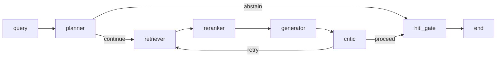

# AI Lab — a compliance copilot for the EU AI Act and GDPR

Ask a question in plain language, get an answer where **every claim traces back to a
specific article or recital** — or an honest "I can't answer that from these sources."

**Live:** [ai-lab-web-ten.vercel.app](https://ai-lab-web-ten.vercel.app) ·
API: [`/health`](https://web-production-ab6a1.up.railway.app/health)

Runs end to end on free tiers. Total infrastructure cost: **$0**.

> **Evaluating me for a project?** The short version is in
> [docs/case-study.md](docs/case-study.md) — architecture, the three
> decisions with the numbers behind them, what it costs to run, and what it can't do. The
> rest of this README is the design document.

---

## Why abstention is the whole point

Most RAG demos answer everything you ask them. That's fine for a docs chatbot and
disqualifying for regulation, where a confident wrong answer about Article 35 is worse
than no answer at all — someone might act on it.

So the design target was never "answer more questions." It was: *when the retrieved text
doesn't actually support a confident answer, say so.* That one requirement drives
everything below — the critic node, the citation validator, the eval metrics, and the
decision to keep a reranker switched off.

Here's the system refusing, on a question it genuinely couldn't ground:

> **Who must appoint a data protection officer under GDPR?**
>
> *This system can't answer that faithfully.* The chunks provided do not contain the
> GDPR provision (Article 37(1)) that lists which controllers or processors must appoint
> a data protection officer. The available text covers group appointments,
> qualifications, staff/service contracts, and involvement, but not the mandatory
> appointment requirement.

That refusal is correct given what the generator was shown — and the diagnosis of *why*
it was shown the wrong five paragraphs is written up in
[Known gaps](#known-gaps-honestly). Both halves matter: the system didn't bluff, and the
failure was traceable to a specific ranking decision.

---

## How it works



Six LangGraph nodes, each one a pure function of typed state:

- **planner** — rewrites the question into a retrieval query, classifies intent, and can
  abstain immediately on out-of-scope questions before spending a single retrieval call.
- **retriever** — cosine search over pgvector (HNSW index, 384-dim embeddings).
- **reranker** — reorders and truncates to the top 5 chunks the generator will see.
- **generator** — answers from **only** those chunks, emitting structured output with a
  `citations` list and an `abstained` flag. Citations are validated against the real
  chunk ids in scope; invented ids are stripped, not trusted.
- **critic** — reviews the draft for unsupported claims and can send the whole thing back
  to *retrieval*, not just regeneration — if the answer was thin, better chunks are more
  likely to fix it than another sampling roll. The loop has a hard iteration cap *and* a
  token budget guard; unbounded loops are treated as bugs.
- **hitl_gate** — pauses via LangGraph's `interrupt()` for human review when confidence
  is low, rather than a bespoke pause mechanism.

State is a single typed `AgentState`. Nodes never call each other — the runtime routes.
The checkpointer is Postgres-backed, so a thread survives a process restart, which
matters on ephemeral free-tier compute.

### The corpus

**1,437 chunks**, ingested at article *and* paragraph grain:

| Source | Articles | Recitals | Chunks |
|---|---:|---:|---:|
| EU AI Act | 113 | 180 | 793 |
| GDPR | 99 | 173 | 644 |

Embeddings are `BAAI/bge-small-en-v1.5` computed **locally on CPU** — never a hosted
embedding API. The ingest is idempotent (`ON CONFLICT DO UPDATE`), so re-running after a
source change is safe.

### Every model call goes through one gateway

`packages/llm/gateway.py` is the only place in the codebase that may name a model. It
owns provider routing and fallback chains, retries with backoff, per-provider concurrency
limits, a semantic cache, budget enforcement, and telemetry. Nothing else imports a
provider SDK.

That single choke point is what made a bad afternoon survivable — see
[the Groq story](#decisions-worth-reading).

### Streaming contract

The API streams **typed node-level events** over SSE (`graph_started`, `node_started`,
`node_completed`, `graph_completed`). The event schema is generated from the Pydantic
models into TypeScript, so the frontend's graph visualisation can't silently drift from
the backend's contract. Each node reports its own latency and cost as it completes —
that's what the live graph on the demo is rendering.

---

## What the numbers say

Layer 3 generation scorecard, all 37 golden items. Scorecards are generated artifacts,
not checked in; `just evals-generation` rewrites them into `evals/reports/`.

| Metric | Score |
|---|---|
| appropriate abstention | 36/37 — 1 false abstention, 0 false answers |
| **faithfulness** | **0.9877** |
| answer relevancy | 0.9767 |
| citation validity | 0.9054 |
| context precision | 0.1676 ⚠️ |

That one false abstention is `cand-041`, and it is the most interesting number here —
see [Known gaps](#known-gaps-honestly). An earlier run scored a flawless 37/37 by
*answering* it instead. That answer was worse.

Retrieval (Layer 1/2, deterministic, 31 scored items — 6 out-of-scope excluded):

| k | recall@k | MRR@k | nDCG@k |
|---:|---:|---:|---:|
| 1 | 0.6290 | 0.6452 | 0.6452 |
| 3 | 0.9355 | 0.7634 | 0.8072 |
| 5 | 0.9677 | 0.7699 | 0.8197 |
| 10 | 1.0000 | 0.7735 | 0.8294 |

Recall@5 used to read 1.0000 here. It dropped when `cand-041` was added — a question the
system genuinely gets wrong, documented in [Known gaps](#known-gaps-honestly). A golden
set that only contains questions the system already answers measures nothing, so the
lower number is the more useful one.

**About that 0.1676.** It's the one metric that looks broken, and it's the one I'd want
to be asked about. It's computed as an exact set intersection between the golden set's
`relevant_chunk_ids` and the chunk ids actually shown to the generator. Because the
corpus is chunked at *both* article and paragraph grain, the retriever legitimately
returns `article:35` and `article:35:paragraph:7` when the golden set names only one of
them — scored as a miss even though the generator saw exactly the right text.
[ADR 0006](docs/adr/0006-context-precision-and-chunk-grain.md) works through the
diagnosis. The honest summary: it's a measurement artifact, and it's documented rather
than quietly dropped from the scorecard.

**The judge is itself checked.** LLM-as-judge numbers are worthless if nobody audits the
judge, so `just evals-judge-agreement` emits a per-case report designed to be read by a
human before the aggregates are trusted — every verdict, its reasoning, and the cited
chunk text side by side.

---

## Decisions worth reading

Six [ADRs](docs/adr/) record the calls that shaped this. The interesting ones:

**[0003 — the reranker that got built, measured, and switched off.](docs/adr/0003-reranking-evaluated-and-deferred.md)**
A local cross-encoder was a stated requirement. It was built and unit-tested. Then it was
measured on the golden set and it made things *worse* — recall@3 dropped 0.967 → 0.933,
nDCG 0.834 → 0.781. So it ships disabled behind an identity passthrough, with the
evidence written down. Building the thing was easy; deleting it from the default path
took the eval harness.

**[0005 — a rate limit that wasn't a rate limit.](docs/adr/0005-deepseek-primary-groq-free-fallback.md)**
Eval runs kept dying against Groq even after waiting a full day. Reproducing the call
outside the gateway surfaced the real error body: a **tokens-per-minute** ceiling, not
the daily quota — a rolling 60-second window that waiting 24 hours does nothing for.
DeepSeek became primary, Groq the fallback. The fix was one registry change *because* all
routing lives behind the gateway.

**[0004 — `import ragas` doesn't.](docs/adr/0004-generation-eval-judge-via-deepeval-not-ragas.md)**
The planned eval library crashes on import against current `langchain-community`. Verified
against the current release, confirmed as a known open bug, switched the judge to
`deepeval`, kept ragas pinned-but-unused with the reason recorded.

---

## Running on $0

Cost discipline is a design constraint here, not a postscript.

- **Embeddings and reranking run on CPU, locally.** Never a hosted embedding API.
- **The demo's headline path costs nothing.** Example questions replay a cached golden
  trace client-side — they work even if the backend is paused, which also means a
  recruiter clicking around can't burn the budget.
- **Live queries are rate-limited per IP** and sit behind a global budget guard, so
  exhaustion degrades into a friendly in-band message instead of an error.
- **The production image was 8.75 GB before the CPU-only torch swap; 2.58 GB after.**
  The default torch wheel drags in several GB of CUDA libraries that a `device="cpu"`
  deployment never loads.

Deployed on Railway (API), Vercel (web), Neon (Postgres + pgvector), Upstash (Redis).

---

## Known gaps, honestly

**The DPO question above is a ranking failure, not a corpus gap.** Article 37(1) *is*
indexed. Cosine similarity ranks it **9th** for that query — the paragraphs of Articles
37 and 38 are so topically similar that the whole top-10 sits inside a 0.026 score band,
and `bge-small` can't separate them. The top-5 cut then drops the one paragraph that
answers "who must appoint."

The interesting part: re-running those same candidates through the disabled cross-encoder
moves Article 37(1) from **rank 9 to rank 2** — comfortably inside the cutoff. So the
component that would fix this query is the one the golden set says to leave off.

The trigger is narrower than it looks. The set already held the same question in the
statute's own vocabulary — *"when am I required to **designate** a DPO under Article 37"* —
which retrieves at rank 2. Dropping the article number changes nothing; swapping the verb
to **appoint** is what costs four ranks. It isn't a general vocabulary gap either:
everyday paraphrases of two other golden items ("privacy impact assessment", "data leak")
still rank 2nd and 1st. The failure needs *both* an everyday synonym and a dense cluster
of near-identical siblings competing for the same five slots.

So rather than flip a switch on one anecdote, the case went into the golden set as
`cand-041` and both configurations were re-run over 37 items:

| k | recall dense → rerank | nDCG dense → rerank |
|---:|---|---|
| 1 | 0.6290 → 0.5323 | 0.6452 → 0.5484 |
| 3 | 0.9355 → 0.9355 | 0.8072 → 0.7757 |
| 5 | 0.9677 → 0.9355 | 0.8197 → 0.7757 |
| 10 | 1.0000 → 0.9355 | 0.8294 → 0.7757 |

**The reranker stays off.** It loses on every metric except a tie at recall@3 — *with the
case that motivated the revisit now in the set.* It fixes `cand-041` and breaks more than
it fixes ([ADR 0003 addendum](docs/adr/0003-reranking-evaluated-and-deferred.md)).

### The part worth reading twice

`cand-041` also caught the generator doing something worse than failing. Two Layer 3 runs,
same retrieval, differing only in the generator's system prompt:

| run | abstained? | faithfulness | citation validity | **context precision** |
|---|---|---|---|---|
| before prompt hardening | no | 1.0 | 1.0 | **0.0** |
| after | yes | — | 0.0 | **0.0** |

`context_precision = 0.0` in *both*: Article 37(1) was never among the five chunks shown.
So in the first run the model answered "who must appoint a DPO" from the *neighbouring*
paragraphs — group appointments, qualifications, contracts — and scored a **flawless 1.0
on faithfulness, relevancy, and citation validity**. Every headline metric said the answer
was perfect. It was faithful to text that doesn't answer the question.

The only number that dissented was `context_precision`, the metric flagged above as a
measurement artifact. On average it *is* an artifact of dual-grain chunking. But a **0.0**
on a single item isn't grain — it means nothing relevant was retrieved at all, and the
mean hides that completely.

After hardening, the model abstains instead, which the abstention metric scores as a
*failure*. That trade — a worse-looking scorecard for honest behaviour — is the one this
project exists to make. `cand-041` is left failing on purpose: it marks the boundary of
what this retrieval stack handles, somewhere it can't be quietly forgotten.

**Also deferred:** token-by-token answer streaming (the contract streams node-level
events; true token streaming needs its own ADR covering cache/retry/budget interactions),
and Layer 4 of the eval harness.

---

## Layout

```
apps/api        FastAPI + LangGraph runtime
apps/web        Next.js, AI SDK v6, streaming UI
apps/ingest     corpus pipeline CLI
packages/core   domain types + Protocols, zero I/O
packages/llm    the gateway — single entry point to any model
packages/retrieval  pgvector, embedders, rerankers
packages/evals  datasets, metrics, runners
docs/adr        architecture decision records
```

`packages/core` defines `Protocol` classes and imports no adapters; dependency arrows
point inward. Pydantic v2 models cross every module boundary — no bare dicts, no regex
parsing of model output.

```bash
just dev           # postgres + redis, then api and web
just test          # 251 fast deterministic tests
just evals-fast    # layers 1+2, deterministic, free
just ingest        # rebuild the corpus index
```

Deployment is documented in [docs/PRODUCTION_DEPLOY.md](docs/PRODUCTION_DEPLOY.md).
